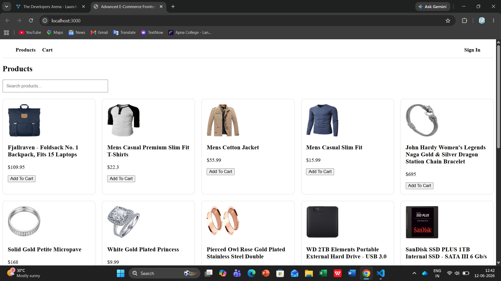
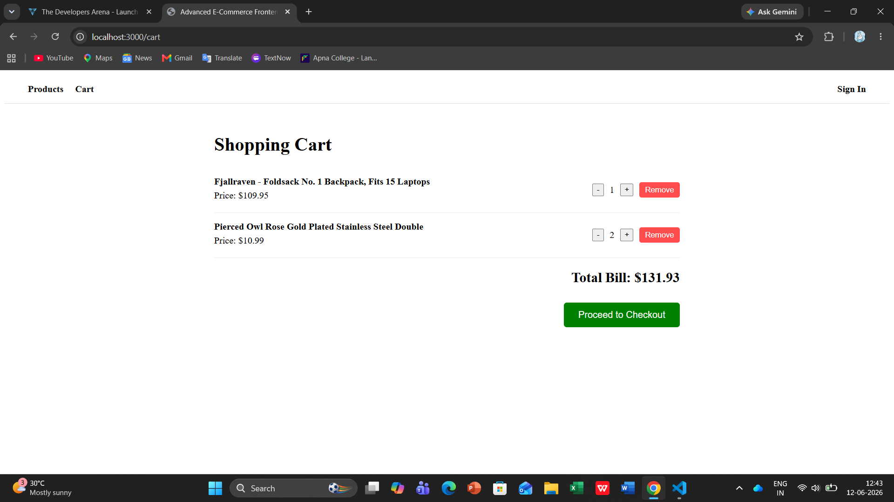
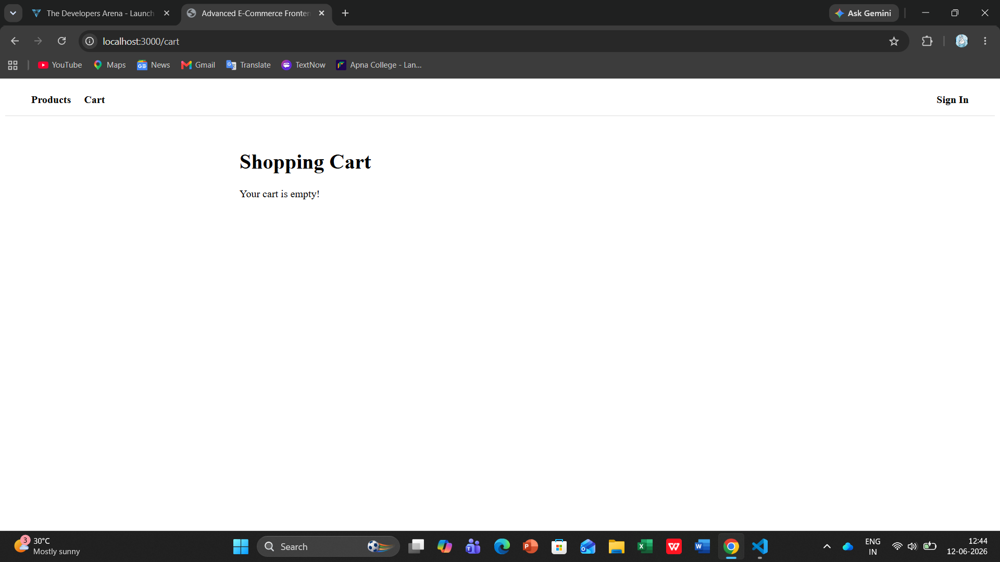
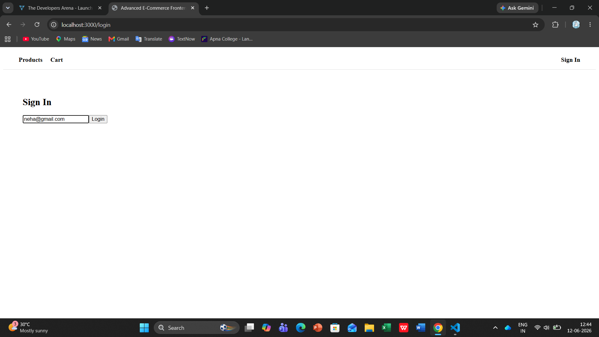
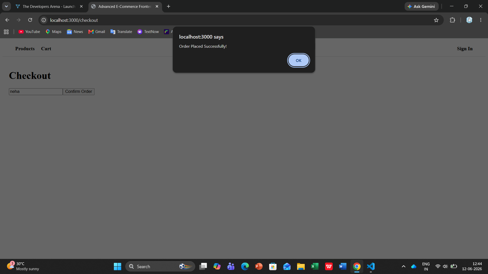
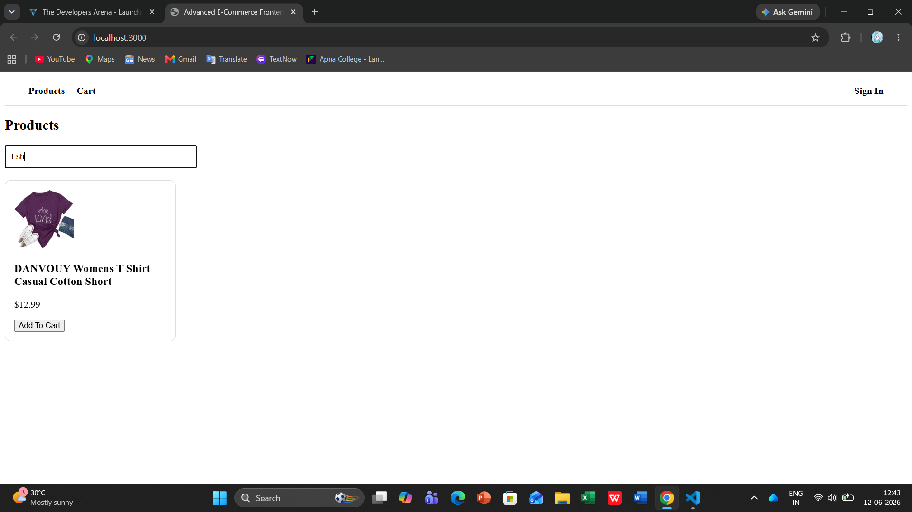
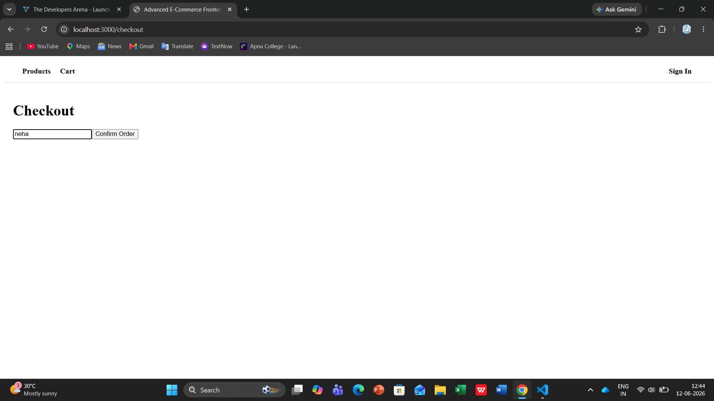
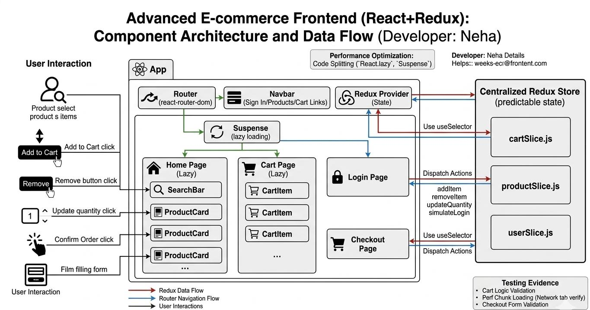

# Advanced E-commerce Frontend

A sophisticated, responsive e-commerce web application built using modern React development practices. This project demonstrates advanced state management, routing, and performance optimization techniques.

## 🚀 Project Overview
This application serves as a fully functional e-commerce frontend. It features a dynamic product catalog, interactive shopping cart with real-time updates, user authentication flow, and a seamless checkout process. The project aims to provide a high-performance, user-friendly shopping interface.

## 🛠️ Tech Stack
* **Frontend:** React 18, React Router DOM
* **State Management:** Redux Toolkit
* **Performance:** React.lazy, React.Suspense (Code Splitting)
* **Styling:** Custom CSS3
* **Build Tool:** Webpack

## 📋 Implemented Features
- **Product Catalog:** Grid layout with items dynamically fetched and searchable.
- **Shopping Cart:** Add/Remove items, real-time quantity updates, and dynamic total bill calculation.
- **User Authentication:** Simulation of sign-in functionality with protected routing concepts.
- **Responsive Design:** Fluid layout optimized for desktops, tablets, and mobile devices.
- **Performance Optimization:** Implemented lazy loading for routes to enhance bundle performance and load times.
- **State Persistence:** Centralized store management using Redux Toolkit slices.

## 📦 Setup Instructions
1. Clone the repository to your local machine.
2. Navigate to the project directory: `cd weeks-ecommerce-frontend`
3. Install the dependencies: `npm install`
4. Start the development server: `npm start`
5. Open [http://localhost:3000](http://localhost:3000) to view it in your browser.

## 🏗️ Code Structure
The project follows a modular and clean architecture:
* `/src/components`: Reusable UI components (Navbar, Cart, ProductCard).
* `/src/pages`: Main application views (Home, Login, Checkout).
* `/src/redux/slices`: State management logic for Cart and User data.

## 🖼️ Visual Documentation
**1. Home Page:**

**2. Shopping Cart:**

**3. Empty Cart State:**

**4. User Authentication (Sign-in):**

**5. Checkout Success:**

**6. Product Search:**

**7. User Details:**

## ⚙️ Technical Details
* **Architecture:** Component-Based Architecture ensuring modularity and reusability.
* **Data Flow:** Unidirectional data flow managed via Redux Toolkit, ensuring state consistency across the application.
* **Optimization:** Leveraged `React.lazy()` for route-level code splitting, significantly reducing initial load times.

## 🧪 Testing Evidence
* **Functionality Validation:** Verified cart calculation logic and checkout form submission validation.
* **Performance Validation:** Implemented lazy loading; verified via Network tab to ensure efficient chunk loading.

## 🏗️ Component Architecture
The application follows a structured component hierarchy:

App
├── Navbar
└── Routes (React Router)
    ├── Home (Product List + ProductCard)
    ├── Cart
    ├── Login
    └── Checkout

The following diagram illustrates the application's structured component hierarchy, data flow, and central state management using Redux Toolkit:

---
### 👤 Developer Details
**Name:** Neha Jaiswal 
**Program:** BCA + MCA Dual Degree  
**Institution:** Amity University  
**Date:** June 12, 2026
